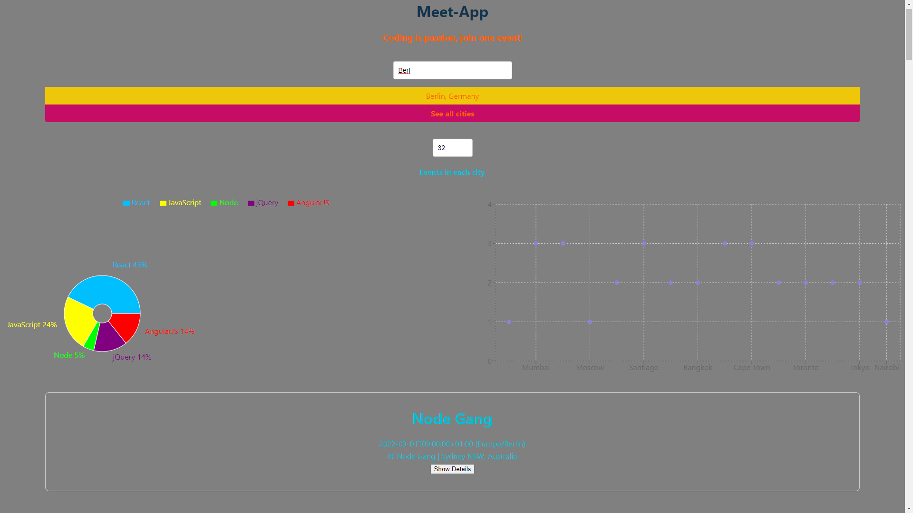

# Meet App

 

 Meet-App is a progressive, serverless web application that uses the APIs provided by Google Calendar API to spread information about tech events to full-stack developers. Users can filter them by location, expand to see detailed descriptions and view summary information using charts.
 This project was built for educational purposes the events fetched from the Google Calendar are fictitious. 

## Live website

Visit Meet app [here](https://cicciotazza.github.io/meet/)


Explore test-driven development as you build a progressive web app for your portfolio. You'll also learn complex Javascript topics such as data visualization.
 
## Languages used
- Javascript
- REACT
- React
- Jest
- Enzyme
- jest-cucumber
- Puppeteer
- Serverless
- Googleapis
- Axios
- Atatus
- nprogress
- Recharts
- gh-pages

## Creator
- [Github](https://github.com/cicciotazza)
- Linkedin (to be filled)
- 
## Tools used
- Visual Studio Code
- GitHub Desktop
- Windows PowerShell 
- NPM
- AWS
  
## Objective  
A serverless, progressive web application (PWA) with React using a test-driven development (TDD) and Google Calendar API to fetch upcoming events

## Key Features
- Filter events by city.
- Show/hide event details.
- Specify number of events.
- Use the app when offline.
- Add an app shortcut to the home screen.
- View a chart showing the number of upcoming events by city.

## User Stories
- Filter events by city to see the list of events that take place in that city.
- Show/hide event details for more/less information about an event.
- Specify the number of events to view in the app at once.
- Use the app when offline but being updated with the events selected when online
- Add the app shortcut to home screen
- See a chart showing the upcoming events in each city.

## Technical Requirements:
- React application.
- Built using the TDD technique.
- Use the Google Calendar API and OAuth2 authentication flow.
- Use serverless functions (AWS lambda) for the authorization server.
- Code hosted in a Git repository on GitHub.
- App running on latest Chrome, Firefox, Safari, Edge, and Opera and IE11.
- Display well on all screen sizes (mobile and tablet) widths of 1920px-320px.
- Pass Lighthouse’s PWA checklist .
- Work offline or in slow network conditions with the help of a service worker.
- Able to install the app on desktop or add it to the home screen on mobile.
- Dployed on GitHub Pages.
- API call must use React axios and async/await.
- Implement an alert system (OOP approach) to show information to the user.
- Make use of data visualization (recharts).
- Covered by tests with a coverage rate >= 90%.
- Monitored using an online monitoring tool.

## Exercises
**Task01**
*Test-Driven Development & Test Scenarios*

**Task02**
*Serverless functions*

**Task03**
*Unit testing*

**Task04**
*Integration testing*

**Task05**
*User Acceptance & End-to-End Testing*

**Task06**
*Object-Oriented Programming*

**Task07**
*Progressive Web Applications*

**Task08**
*Data visualization*

## Installation and set up

This project requires Node.js, documentation can be found [here](https://nodejs.org/en/).

To install Meet app run: 
```
npm install
```
Navigate to the auth-server directory and run the command again. This will install the modules required by files inside the auth-server specifically.

At this stage the local repository should contain: 
- The Meet app files and node modules required to build the project components
- A handler.js file containing the serverless functions used to handle the OAuth process
- A serverless.yml file where the authorisation server endpoints are configured. 

**In order to recreate the project in full using data from the Google Calendar API and implementing the OAuth process, you will need to complete the following additional steps:** 
- Set up your project on Github and use github pages to provide a live website URL for your app
- Register your app with Google to obtain OAuth credentials
- Set up an authorisation server with AWS Lambda and (re)deploy the serverless functions
- Save the reconfigured files to github and deploy to the live website

The detailed instructions for these steps are as follows:

**Setting up the project and generating a URL**<br>
- Create a github repository for your project. This will allow you to use github pages to create the live website that will host the app and interact with the authorisation server. Your github pages URL will be: https://your_github_username.github.io/your_repository_name.
- Replace the homepage URL in the package.json file with your github pages URL. 
- In the auth-server directory handler.js file, update the credentials object properties: redirect_uris (including / at the end of the URL) and javascript_origins. 
- In the WelcomeScreen.jsx file, update the href for the privacy policy. 
- Initialize git in the project directory, add your repository URL and push the changes.
The gh-pages package is already installed and configured to publish your app to the live website when the project is deployed.

**Registering the app with Google**<br>
- To implement OAuth2.0 and access the Google Calendar API, you must first register your app with Google to obtain the credentials that are required during the authorisation process.
- Navigate to the [Google developers console](https://console.developers.google.com). Click create project, name your project, click create. Select enable APIs and services, search for and select the Google Calendar API, enable it.
- Now you need to set up credentials. Click create credentials and select the following options: Google Calendar API, called from a web browser using JavaScript, accessing user data, external users. Click create.
- Next complete the OAuth consent screen where you will provide your contact details as the developer responsible for the app. Add yourself as a test user. Then complete the scopes section: select ../auth/calendar.readonly. Click update then save and continue.
- Now create your OAuth client ID: complete the fields specifying web app and your app name. For authorized JavaScript origins enter the domain from your github pages site URL. For the authorized redirect URIs use the full github pages URL with / at the end (this mirrors the changes you made to the handler.js file above so everything is now pointing to your own github pages website). Click create. Your credentials will now be available to download and will also be available on the credentials page of your google console.
- Finally **inside the auth-server directory** create a config.json file. Inside the file, add the following object, replacing the values with the credentials you obtained from Google and your project ID (you will find the project ID on your Google dashboard):<br>
{
  "CLIENT_ID": "YOUR_GOOGLE_CLIENT_ID",<br>
  "PROJECT_ID": "YOUR_GOOGLE_PROJECT_ID",<br>
  "CLIENT_SECRET": "YOUR_GOOGLE_CLIENT_SECRET",<br>
  "CALENDAR_ID": "fullstackwebdev@careerfoundry.com"<br>
}<br>
This file is already included within the .gitignore file so your credentials will remain secure.

**Setting up the remote authorisation server**<br>
- At this stage the project already contains an auth-server directory and the serverless functions needed to manage the authorisation process. The functions now need to be deployed to your own AWS Lambda remote server.
- Start by creating an Amazon Web Services account [here](https://aws.amazon.com/lambda/?c=ser&sec=srv)
- Log in to the management console, click on your username and select My Security Credentials from the dropdown menu.
- Select Access keys (access key ID and secret access key) then click Create New Access Key. Download the key file and store it in a safe place. This contains both your Access Key ID and Secret Access Key.
- The framework Serverless is used to deploy the serverless functions in the auth-server directory to your AWS remote server. To install Serverless globally, open a terminal and run:
```
npm install -g serverless
```
- Now **inside the auth-server directory** delete the .serverless folder. You will recreate this when the functions are (re)deployed to your own AWS account.
- Still in the auth-server directory run the following command **replacing the values with the Access Key ID and Secret Access Key that you just retrieved from AWS:**
```
serverless config credentials --provider aws --key YOURACCESSKEYID --secret YOURSECRETKEY
```
- Finally, to deploy the serverless functions to your remote server remain inside the auth-server directory and run:
```
serverless deploy
```

**Saving the reconfigured files to github and deploying to the live website**<br><br>
By this stage your local files should be configured to run the app using your new cloud-based server and hosted on the live website URL linked to your github repository. To deploy the app, commit all of your changes and push to your main github branch then run:
```
npm run deploy
```
Your app should now be live at your github pages URL!

## Future features
- The focus of this project was on developing functionality using a test-driven approach therefore basic styling has been used for the initial release.
- Apps registered with Google are considered to be in test and display a warning until a full verification process has been completed. Google verification will be sought on completion of the updated UI.